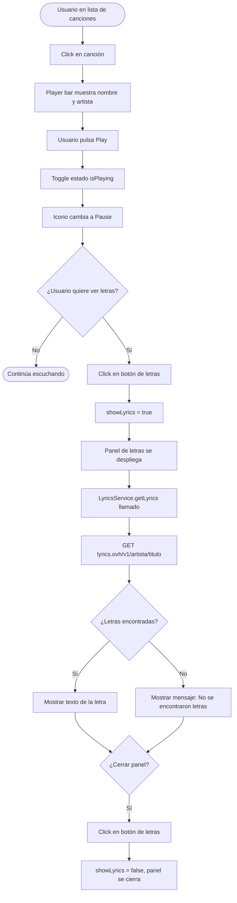
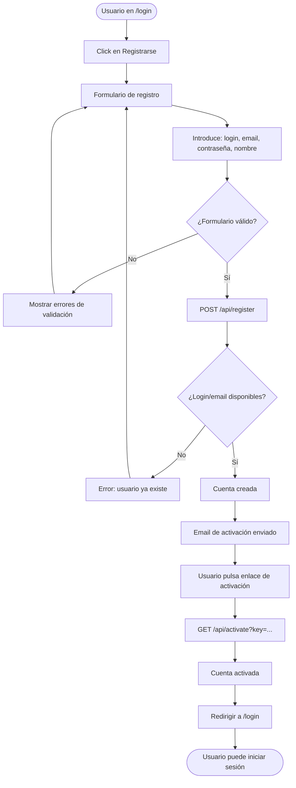
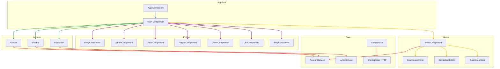
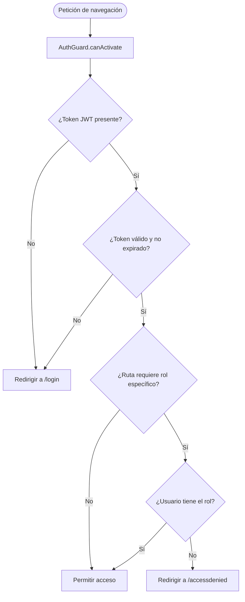

# Diagramas de Flujo — MusicPlayer

Los diagramas están escritos en sintaxis **Mermaid** y se renderizan automáticamente en GitHub, GitLab y VS Code (extensión Mermaid Preview).

---

## 1. Flujo de autenticación

---

## 2. Flujo de reproducción y letras de canción

---

## 3. Flujo de gestión de playlist

---

## 4. Flujo de registro de usuario

---

## 5. Diagrama de componentes Angular

---

## 6. Flujo de control de acceso por rol

