# Diagramas de Flujo — MusicPlayer

Este documento recoge los diagramas de flujo del sistema MusicPlayer. Cada sección incluye una descripción del proceso representado, el código Mermaid que define el diagrama y la imagen renderizada del mismo. Los diagramas están escritos en sintaxis **Mermaid** y se renderizan automáticamente en GitHub, GitLab y VS Code (extensión Mermaid Preview).

---

## 1. Flujo de autenticación

Cuando alguien accede a MusicPlayer por primera vez, lo primero que hace la aplicación es comprobar si ya tiene un token JWT guardado en `localStorage` del navegador. Si lo encuentra y es válido, carga directamente el perfil del usuario y lo lleva al dashboard que le corresponde según su rol. Si no lo tiene —porque nunca ha entrado o porque el token expiró— lo manda a la pantalla de login.

En la pantalla de login, el usuario introduce su usuario y contraseña, que se envían al backend mediante una petición POST a `/api/authenticate`. El backend valida las credenciales y, si son correctas, devuelve un token JWT que la aplicación guarda en `localStorage`. A partir de ahí, ese token va incluido en todas las peticiones que hace el cliente al servidor.

Al final del proceso, el sistema decide a qué dashboard redirigir al usuario según el rol que tiene asignado: el administrador va a su panel de gestión, el editor y el artista van al panel de catálogo, y el oyente va a su página de inicio con sus playlists y su historial.

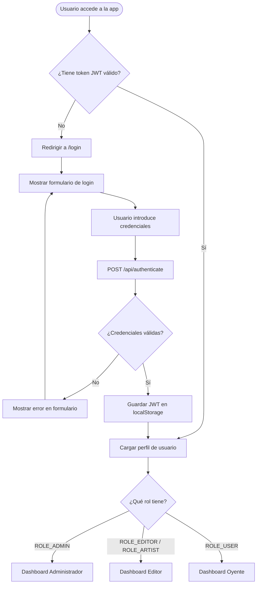

---

## 2. Flujo de reproducción y letras de canción

Este es el flujo más habitual en la aplicación: el usuario elige una canción, la reproduce y decide si quiere ver su letra o no.

Cuando el usuario pulsa sobre una canción en la lista, la barra del reproductor (el player bar) muestra el nombre y el artista de esa canción. Al pulsar el botón de Play, la señal interna `isPlaying` del componente cambia de valor y el icono del botón alterna entre el triángulo de play y las dos barras de pausa.

Si el usuario quiere leer la letra mientras escucha, pulsa el botón de letras en el player bar. Eso activa la señal `showLyrics` y hace que el panel de letras se despliegue. En ese momento, el componente llama a `LyricsService`, que realiza una petición a la API `lyrics.ovh` con el nombre del artista y el título de la canción. Si la API encuentra la letra, la muestra en el panel. Si no la encuentra, muestra un mensaje informando de ello. En cualquier caso, el usuario puede volver a pulsar el botón de letras para cerrar el panel cuando quiera.

---

## 3. Flujo de gestión de playlist

Las listas de reproducción son la herramienta principal que tiene el oyente para organizar el contenido que le gusta. El diagrama muestra las tres operaciones principales que puede hacer un usuario sobre sus playlists: crear una nueva, añadir canciones a una que ya existe y eliminar una playlist completa.

En los tres casos el flujo pasa por el backend con operaciones REST estándar: POST para crear, POST en `/api/playlist-songs` para añadir canciones, y DELETE para eliminar. La acción de eliminar incluye un paso de confirmación para evitar borrar playlists por error.

Es importante tener en cuenta que todas las playlists pertenecen a un usuario concreto. Las que son privadas (`isPublic: false`) solo las puede ver el propietario; las demás pueden ser visibles para otros usuarios.

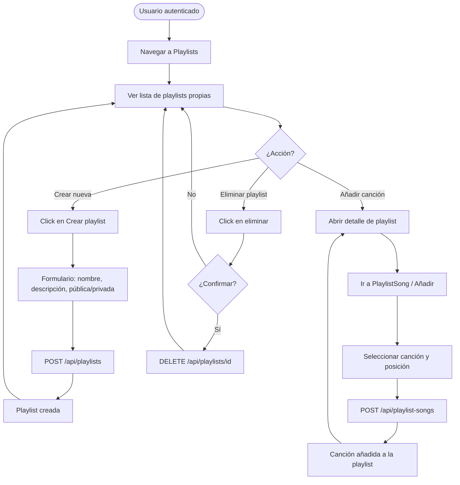

---

## 4. Flujo de registro de usuario

El registro en MusicPlayer no es inmediato. Para garantizar que la dirección de correo electrónico introducida existe y pertenece realmente al usuario que se registra, el sistema usa un flujo de activación por enlace único.

Cuando el usuario rellena el formulario de registro y lo envía, el backend crea la cuenta con el estado "no activada" y genera una clave de activación aleatoria que guarda en la base de datos. Acto seguido, envía un correo al usuario con un enlace que contiene esa clave. Mientras el usuario no pulse el enlace, su cuenta existe en el sistema pero no puede usarse para iniciar sesión.

Al pulsar el enlace del correo, el frontend llama al endpoint de activación (`GET /api/activate?key=...`) con esa clave. El backend la valida —comprueba que existe y que no ha expirado, porque tiene una validez de tres días—, y si todo está en orden activa la cuenta. Solo entonces el usuario puede iniciar sesión normalmente.

---

## 5. Diagrama de componentes Angular

Este diagrama muestra la estructura de componentes del frontend y cómo se relacionan entre sí. La raíz de la aplicación es `AppComponent`, que contiene `MainComponent`. Este componente raíz es el responsable de componer los tres elementos de maquetación que siempre están visibles (navbar, sidebar y player bar) junto con el router outlet, que es el espacio donde se renderiza el componente correspondiente a la ruta activa.

Los dashboards (`DashboardAdmin`, `DashboardEditor`, `DashboardUser`) son hijos de `HomeComponent` y se muestran de forma condicional según el rol del usuario autenticado. Los módulos de entidades (Song, Album, Artist, Playlist, Genre, Like, Play) son componentes de ruta que se cargan cuando el usuario navega a sus URLs respectivas.

Los servicios del core (AuthService, AccountService, LyricsService) son inyectables globales que los componentes consumen mediante la inyección de dependencias de Angular, sin necesidad de importarlos en módulos específicos gracias al modo standalone.

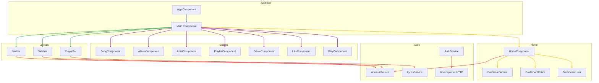

---

## 6. Flujo de control de acceso por rol

Cada vez que el usuario intenta navegar a una ruta protegida, el `AuthGuard` de Angular intercepta la navegación antes de que el componente de destino se cargue y realiza una serie de verificaciones.

Primero comprueba si hay un token JWT en `localStorage`. Si no lo hay, redirige directamente a la página de login. Si lo hay, comprueba que ese token no ha expirado. Un token expirado es tan inválido como no tener ninguno, así que el comportamiento es el mismo: redirigir al login.

Si el token existe y es válido, el guard comprueba si la ruta a la que se intenta acceder requiere un rol específico (por ejemplo, que el usuario tenga `ROLE_ADMIN`). Si la ruta no tiene requisito de rol, el acceso se permite directamente. Si tiene requisito de rol y el usuario lo tiene, también se permite. Si el usuario no tiene el rol requerido, se le redirige a la página de acceso denegado.

Este mecanismo en el frontend complementa el control de acceso del backend: aunque alguien consiga saltarse el guard del frontend, Spring Security devolverá un error 403 en la siguiente petición a la API si el token no tiene el rol requerido por el endpoint.

---

## 7. Flujo de subida de ficheros (imagen y audio)

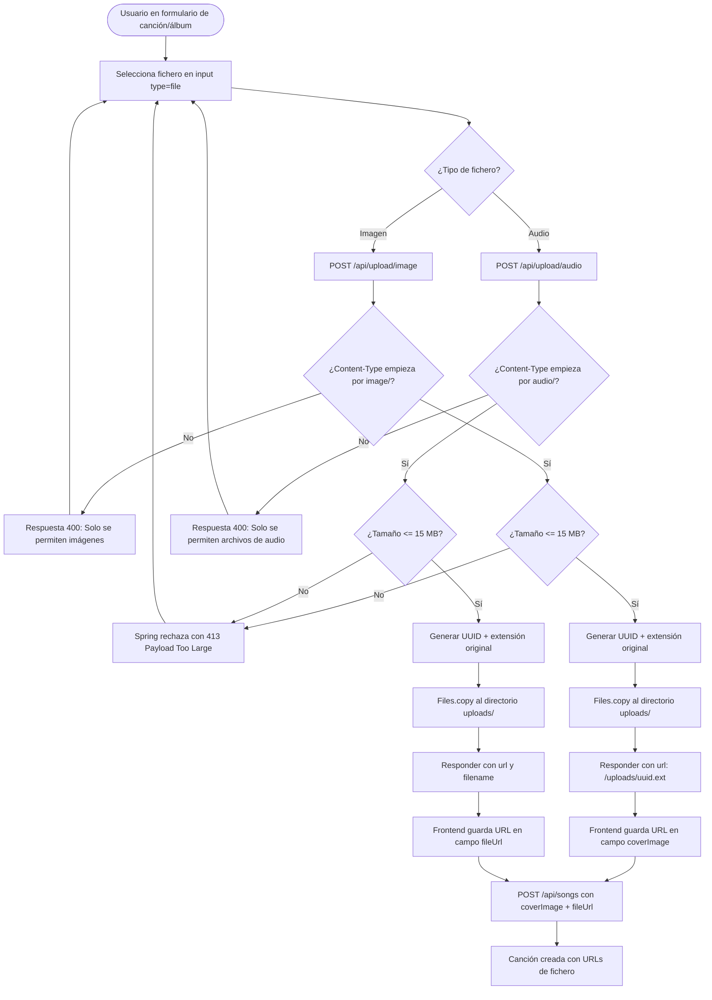

---

## 8. Flujo de streaming de audio con rangos HTTP

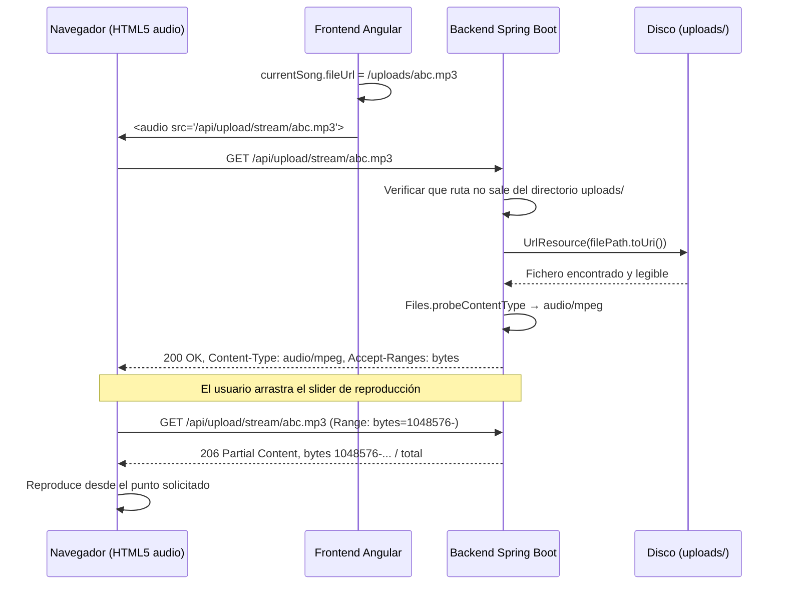

---

## 9. Patrón de propiedad en la capa de servicio (Ownership)

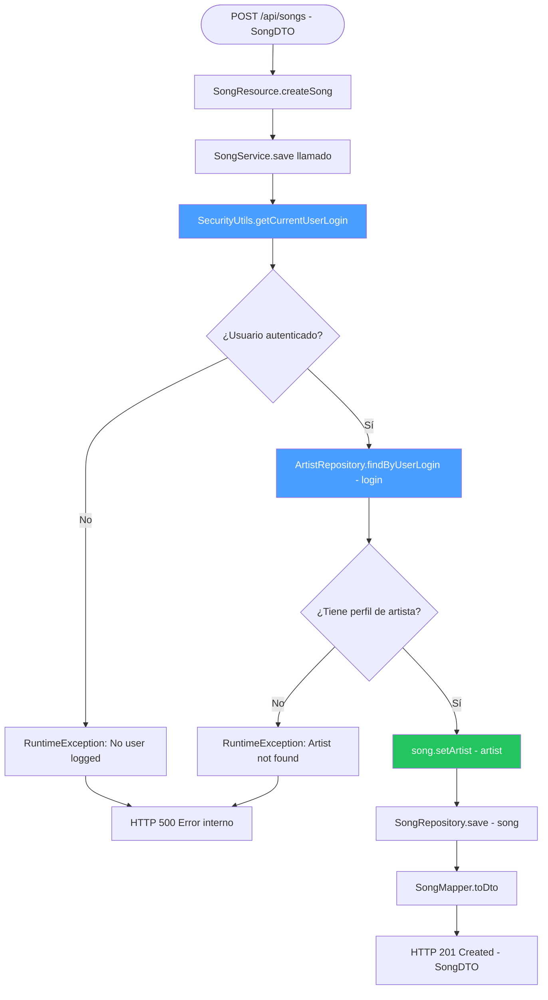

---

## 10. Flujo de búsqueda de canciones en tiempo real

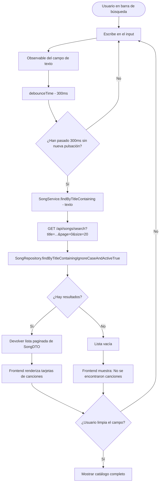

---

## 11. Flujo de canciones favoritas (Likes)

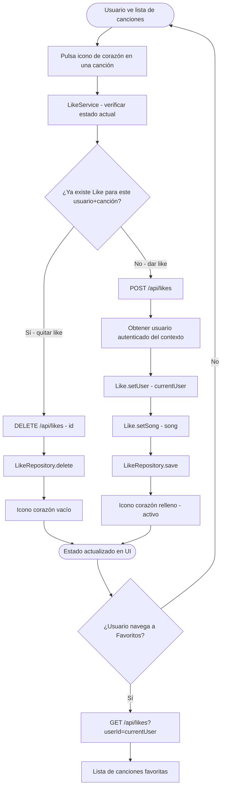

---

## 12. Diagrama de secuencia — Ciclo completo de creación de canción

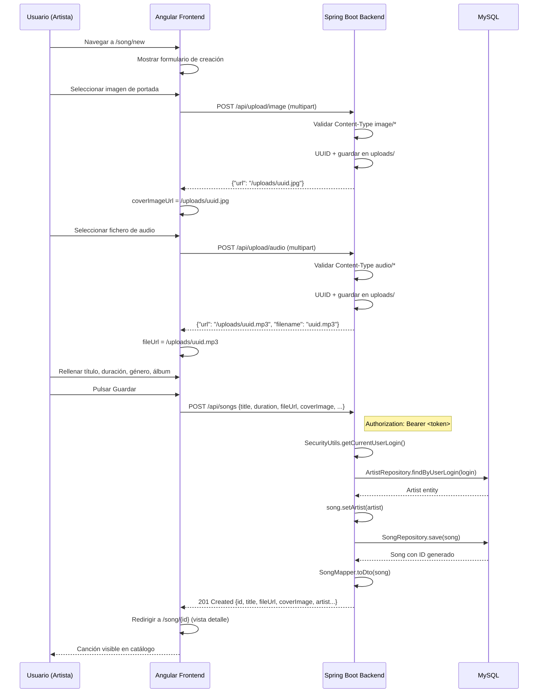

---

## 13. Diagrama de componentes Backend — Capa de servicio

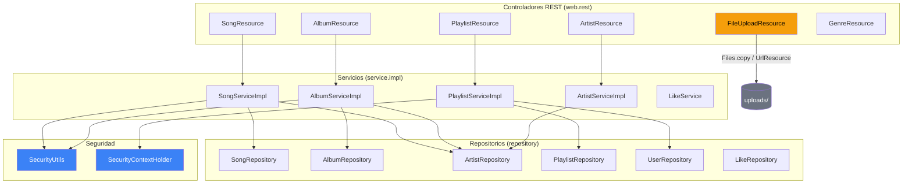

---

## 14. Diagrama de estados del reproductor Angular

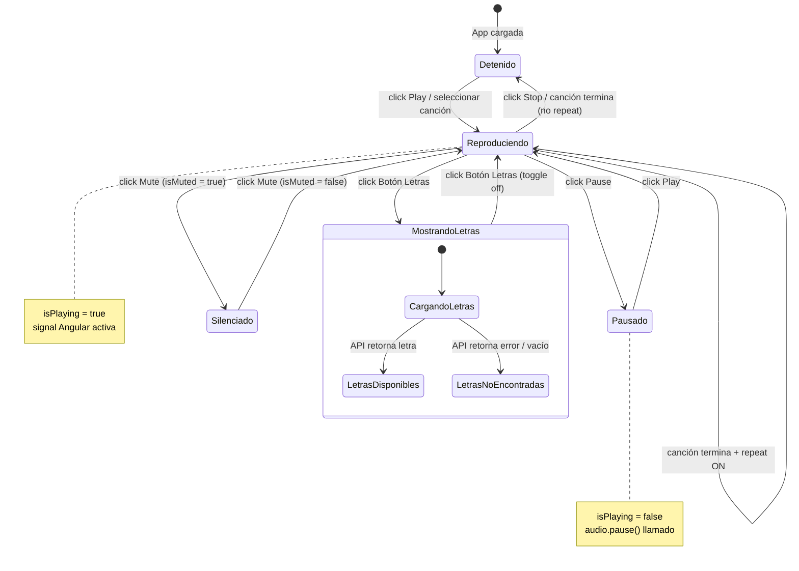
